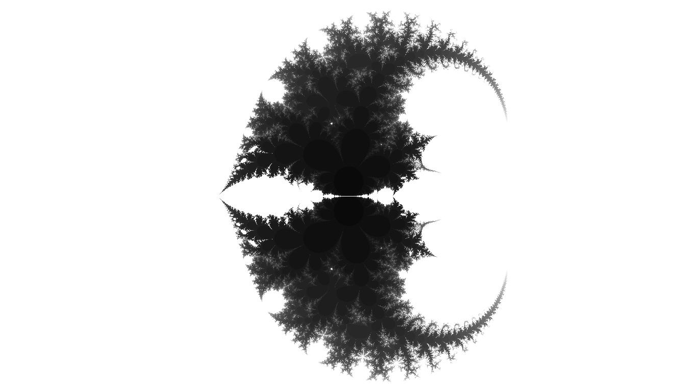
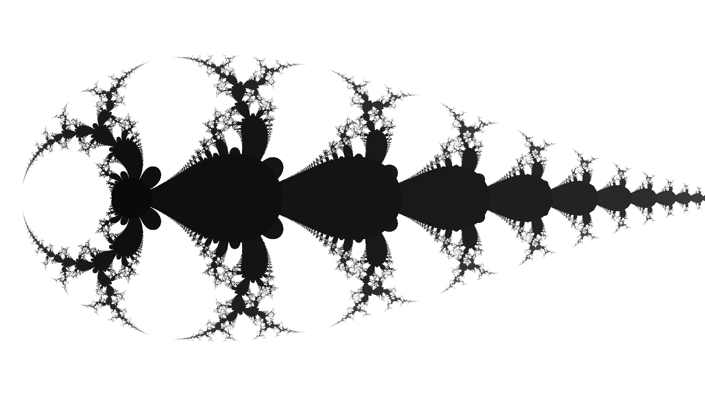
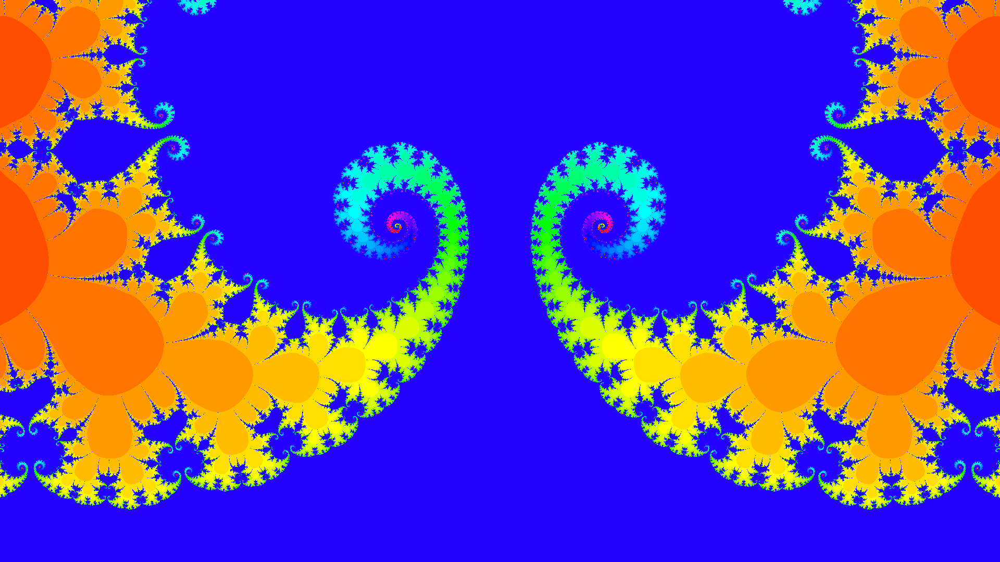

# Fractale

## Principe :
Ce projet permet de réaliser et explorer des ensembles de Mandelbrot et ensembles de Julia

## Exemples de résultats :

Ensemble de Mandelbrot pour la suite  

 

Et avec une valeur initiale de la suite telle que  :

 

Pour la suite  on obtient :

 

Et pour la suite  on obtient :

## Comment l'ouvrir et le lancer :
-Télécharger Processing 3 : https://processing.org/download/

-Ouvrir et lancer "Fractale.pde" avec Processing 3

Ou alors lancer le projet JAVA "Fractale v6 Java" avec, par exemple, NetBeans
